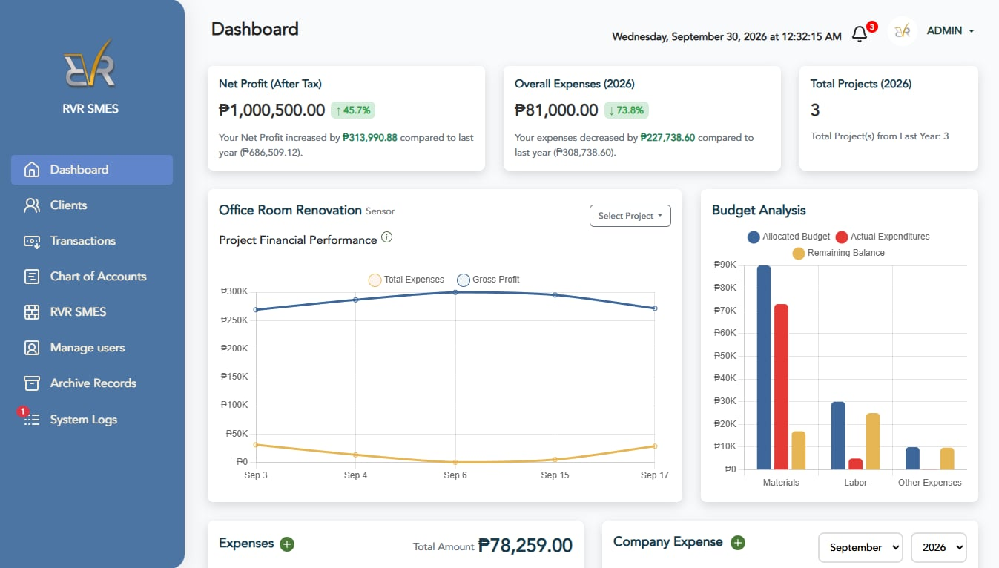

# RVR SMES Financial Management System

A PHP/MySQL web application for managing client records, project budgets, operating expenses, financial reports, and role-based access for a mechanical engineering services company.

## Dashboard Preview



## Overview

This system is designed to help a business track:

- Clients and their project history
- Project creation, approval, and deadlines
- Budget allocation and validation
- Project expenses and company expenses
- Cash flow, balances, and income reports
- Notifications for project actions and approvals
- Archived records and audit-style activity tracking

## Key Features

- User login and session-based authentication
- Role-based access for admin, finance, and user accounts
- Client management dashboard
- Project creation and approval workflow
- Budget validation checks before project submission
- Expense recording with file/receipt support
- Financial summaries and reports
- Deadline and review notifications
- Archive and restore functions for historical records
- Profile and password management

## Tech Stack

- PHP
- MySQL
- JavaScript / jQuery / Bootstrap
- Composer
- PHPMailer for email notifications
- PDF parsing library for document processing

## Project Structure

```text
Financial_Management/
├── dbcon.php
├── index.php
├── login_form.php
├── composer.json
├── forms_logic/
│   ├── project_logic.php
│   ├── login_logic.php
│   ├── approve_project.php
│   ├── approve_finance.php
│   ├── update_project_status.php
│   └── ...
├── inner_pages/
│   ├── clients.php
│   ├── projects.php
│   ├── expenses.php
│   ├── company_exp.php
│   ├── cashflow.php
│   ├── balance.php
│   ├── proj_budget_sum.php
│   └── ...
├── layout/
├── resources/
├── uploads/
├── receipts/
├── user/
├── vendor/
└── README.md
```

## Requirements

Before running the app, make sure you have:

- XAMPP / WAMP / Apache + MySQL
- PHP 7.4+ or compatible version
- Composer installed
- MySQL database access

## Installation and Setup

1. Place the project inside your local web root, for example:

   ```text
   C:\xampp\htdocs\Financial_Management
   ```

2. Start Apache and MySQL from XAMPP.

3. Create a MySQL database named:

   ```text
   financial_management
   ```

4. Update the database connection in [dbcon.php](dbcon.php) if needed:

   ```php
   $host = 'localhost';
   $user = 'root';
   $password = '';
   $database = 'financial_management';
   ```

5. Install Composer dependencies from the project root:

   ```bash
   composer install
   ```

6. Open the app in the browser:

   ```text
   http://localhost/Financial_Management/login_form.php
   ```

## Login and Access

The application uses session-based authentication and role checks. Based on the source code, the app supports these roles:

- admin
- finance
- user

Access is restricted in several pages by checking the logged-in user role in PHP logic.

## Core Workflow

### 1. Login
The login screen is in [login_form.php](login_form.php). It includes:

- email and password fields
- remember-me option
- role-based redirect after login

### 2. Manage Clients
Clients are managed through [inner_pages/clients.php](inner_pages/clients.php). This page allows adding and viewing client records.

### 3. Create Projects
Projects are created through the project workflow tied to client records and validation logic in [forms_logic/project_logic.php](forms_logic/project_logic.php).

Important checks in the source include:

- allocated budget cannot exceed project cost
- allocated budget cannot be below 1000
- project cost cannot be below 1000
- duplicate overlapping project validation
- contract file validation for upload

### 4. Approval Process
Project approval logic is implemented in:

- [forms_logic/approve_project.php](forms_logic/approve_project.php)
- [forms_logic/approve_finance.php](forms_logic/approve_finance.php)

The system tracks user approval and finance approval before the project is considered fully approved.

### 5. Record Expenses
Expense handling is spread across files such as:

- [inner_pages/expenses.php](inner_pages/expenses.php)
- [inner_pages/batch_expense.php](inner_pages/batch_expense.php)
- [inner_pages/company_exp.php](inner_pages/company_exp.php)

These pages likely handle project expenses and company expenses separately.

### 6. Review Reports and Dashboard
The main dashboard is [index.php](index.php). It retrieves project and expense data and calculates summary metrics for:

- total company expenses
- project totals
- deadlines
- budget comparisons
- report panels and charts

## Database Notes

The app expects a MySQL database with tables such as:

- users
- clients
- projects
- expenses
- company_expense
- payment_clients
- contracts
- user_notifications
- edit_logs
- archives / archived tables

The code references several tables and fields directly, so the database schema must match the application logic.

> No SQL schema file was found in the root project folder, so the database must be created/imported separately.

## Important File References

These files are useful starting points when understanding the system:

- [dbcon.php](dbcon.php) — database configuration
- [login_form.php](login_form.php) — login page
- [index.php](index.php) — main dashboard and financial summary
- [inner_pages/clients.php](inner_pages/clients.php) — client management
- [inner_pages/projects.php](inner_pages/projects.php) — project management
- [forms_logic/project_logic.php](forms_logic/project_logic.php) — project creation and validation
- [composer.json](composer.json) — PHP package dependencies

## Notes for Developers

- The application is tightly integrated with session-based access control.
- Many modules rely on direct MySQL queries instead of an ORM or framework.
- Some code appears to be in active development, with commented-out blocks and alternate connection logic in place.
- The UI is built heavily with Bootstrap and custom CSS for the ERP-style pages.

## Future Improvements

Potential improvements could include:

- a central SQL schema migration file
- environment-based configuration instead of hardcoded database credentials
- improved security hardening and validation
- unit/integration testing
- clearer documentation for each admin and finance workflow

## License

This project does not currently include a visible license file in the root directory. Please confirm the licensing terms with the project owner before distributing or reusing it publicly.

## Conclusion

This project is a business-focused financial management system for tracking projects, costs, approvals, budgets, and generated financial summaries. It is intended for internal use in a company workflow and is structured around a classic PHP + MySQL dashboard and management portal.
